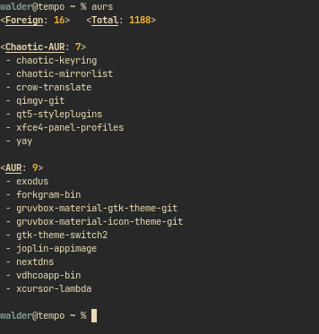

# stuff - a collection of various ~~useful~~ things  

### table of stuff  

* [links to stuff](#links-to-stuff) - hyperlinks to websites on the world wide web  
* [script stuff](#script-stuff) - shell scripts  
  * **[bash](#--bash-shell-scripts--)**   
    * [colorme.sh](#colorme) - 16 colors displayed using pretty format  
    * [showcolors.sh](#showcolors) - displays either 16 or 256 colors, defaults to 16  
    * [getip.sh](#getip) - HTTP request to output public facing IP address  
    * [aurs.sh](#aurs) - count and show AUR/Chaotic-AUR packages on Arch Linux
* [stuff for shells](#stuff-for-shells) - some shell functions, aliases, and stuff  
  * **[bash functions](#--bash-shell-functions--)** 
    * [faketty()](#faketty) - allows color output for piped commands  
  * **[zsh functions](#--zsh-shell-functions--)** 
    * [currdate()](#currdate) - unfinished, sets $DATE, a variable with a future in file naming  
---  

[`^`](#)

<br />

# links to stuff  
---
### :small_orange_diamond: **GitPop3** :small_orange_diamond:
  * "Find the most popular fork on GitHub."
  * <https://andremiras.github.io/gitpop3/>
---
### :small_orange_diamond: **awesome-selfhosted** :small_orange_diamond:
  * a list of software for self-hosting of services
  * <https://github.com/awesome-selfhosted/awesome-selfhosted>  
---
### :small_orange_diamond: **awesome-sysadmin** :small_orange_diamond:
  * a list of open source sysadmin resources 
  * <https://github.com/awesome-foss/awesome-sysadmin>  
---
### :small_orange_diamond: **awesome-security** :small_orange_diamond:
  * a list of security related software, libraries, resources, etc 
  * <https://github.com/sbilly/awesome-security#monitoring--logging>  
---
### :small_orange_diamond:  **systemd tips & tricks** :small_orange_diamond:
  * tips & tricks for systemd 
  * <https://www.freedesktop.org/wiki/Software/systemd/TipsAndTricks/>  
---
### :small_orange_diamond:  **Operational Awareness** :small_orange_diamond:
  * "Cyber Operations: Building, Defending, and Attacking Modern Computer Networks" 
  * <https://goois.net/3-operational-awareness-cyber-operations-building-defending-and-attacking-modern-computer-networks.html>  
---
### :small_orange_diamond:  **a handy arch related wiki** :small_orange_diamond:
  * solid, detailed hardening configurations and various tips 
  * <https://kyau.net/wiki/Category:Arch_Linux>  
---
### :small_orange_diamond:  **grml zsh** :small_orange_diamond:
  * home of grml-zsh-config - *the* zsh config
  * <https://grml.org/zsh/>  
---
### :small_orange_diamond:  **linux post-installation tasks** :small_orange_diamond:
  * from fedora, good over-all information and reference 
  * <https://docs.fedoraproject.org/en-US/fedora-server/sysadmin-postinstall/>  
---
### :small_orange_diamond:  **RoseHosting blog** :small_orange_diamond:
  * hundreds of linux related posts with good information
  * <https://www.rosehosting.com/blog/>  
---
### :small_orange_diamond:  **bash scripting cheatsheet** :small_orange_diamond:
  * "The Only Bash Scripting Cheat Sheet That You Will Ever Need" 
  * <https://dev.to/bobbyiliev/the-only-bash-scripting-cheat-sheet-that-you-will-ever-need-55c7>  
---
### :small_orange_diamond: **learning the shell** :small_orange_diamond:
  * commandline and scripting reference, free book(s) for download 
  * <https://linuxcommand.org/lc3_learning_the_shell.php>  
---
### :small_orange_diamond:  **joplin/plugins** :small_orange_diamond:
  * official joplin plugin repository 
  * <https://github.com/joplin/plugins>  
---
### :small_orange_diamond:  **the book of secret knowledge** :small_orange_diamond:
  * manuals, cheatsheets, blogs, hacks, one-liners, cli tools, etc 
  * <https://github.com/trimstray/the-book-of-secret-knowledge>  
---
### :small_orange_diamond:  **malware analysis tools list** :small_orange_diamond:
  * extensive list of hacker shit, i don't know much else 
  * <https://0x1.gitlab.io/security/Malware-Analysis-Tools-List/#browser-malware>  
---
### :small_orange_diamond:  **linux workstation security checklist** :small_orange_diamond:
  * security checklist for the linux workstation 
  * <https://github.com/lfit/itpol/blob/master/linux-workstation-security.md>  
---
### :small_orange_diamond:  **Madaidan's Insecurities - Security & Privacy Evaluations** :small_orange_diamond:
  * "information on security and privacy-related topics" but hardcore
  * <https://madaidans-insecurities.github.io>  
---
### :small_orange_diamond:  **fzf usage examples** :small_orange_diamond:
  * fzf implementations, usage examples, scripts, etc. 
  * <https://github.com/junegunn/fzf#usage>  
---
### :small_orange_diamond:  **Privacy Guides** :small_orange_diamond:
  * good resource with vetted privacy-oriented solutions
  * <https://www.privacyguides.org/>  
---
### :small_orange_diamond:  **Privacy Tools** :small_orange_diamond:
  * the original resource with vetted privacy-oriented solutions
  * <https://www.privacytools.io/>  
---
### :small_orange_diamond:  **stargraph** :small_orange_diamond:
  * github star history plots, neat graphs about top github projects 
  * <https://github.com/nschloe/stargraph>  
---
### :small_orange_diamond:  **bufferbloat and speedtest** :small_orange_diamond:
  * speedtest tool like dslreport's test, works in modern browsers 
  * <https://www.waveform.com/tools/bufferbloat>  
---
### :small_orange_diamond:  **vermaden's sysadmin blog** :small_orange_diamond:
  * lots of FreeBSD and server related guides from a sysadmin 
  * <https://vermaden.wordpress.com/>   
---
### :small_orange_diamond:  **calomel -nix guides** :small_orange_diamond:
  * "Open Source Resource and Reference"  lots of guides, etc.
  * <https://calomel.org/>  
---
### :small_orange_diamond:  **a favorite quote of mine's "history"** :small_orange_diamond:
  * "You’ll Worry Less About What People Think of You When You Realize How Seldom They Do"
  * <https://quoteinvestigator.com/2014/09/09/worry-less/>  
---

[`^`](#)

<br />

# script stuff

##### \- bash shell scripts -  

## colorme  
 - outputs 16 colors with a pretty format

  ->  [colorme.sh](scripts/colorme.sh)  <-  
	->  [colorme-screenshot.png](screenshots/colorme-screenshot.png)  <-  
  
<details><summary>show screenshot</summary>

  

</details>  
  
<details><summary>show script source code</summary>

```bash
#!/bin/bash
#
# basic 16 color codes output in nice format
#
saythis='butts'
echo -e "\n\t   40m\t   41m\t   42m\t   43m\t   44m\t   45m\t   46m\t   47m";
for lfg in 'm' '1m' '30m' '1;30m' '31m' '1;31m' '32m' '1;32m' '33m' '1;33m' '34m' '1;34m' '35m' '1;35m' '36m' '1;36m' '37m' '1;37m';
  do sfg=${lfg//\t/}
  echo -en "$lfg\t"
  for sbg in 40m 41m 42m 43m 44m 45m 46m 47m;
    do echo -en " \033[$sfg\033[$sbg $saythis \033[0m";
  done
 echo
done
```

</details>  

- - -
<br />


## showcolors  
 - outputs either 16 or 256 colors, defaults to 16

  ->  [showcolors.sh](scripts/showcolors.sh)  <-  
	->  [showcolors256-screenshot.png](screenshots/showcolors256-screenshot.png)  <-  
  
<details><summary>show screenshot</summary>


</details>  
  
<details><summary>show script source code</summary>

```bash
#!/bin/bash
#
USAGE="\nusage:\n\tshowcolors [ -t 256,16 | --term 256,16 | --256, --16 | 256, 16 ]\nexamples:\n\tshowcolors -t 256 \n\tshowcolors 256\n\tshowcolors -16\n\tshowcolors --term 256\ndefault:\n\tshowcolors --term 16\n"
if [[ -z $1 ]];
  then
    echo -e "{$USAGE}"
		term=16
		echo -e "\n\n\t\tno arguments were passed; assuming \"--term 16\"\n\n"
	elif [[ $1 =~ ^(-t|--term) ]]; then
    term="$2"
  elif [[ $1 =~ ^(-256|256|--256) ]];  then 
    term=256
  elif [[ $1 =~ ^(-16|16|--16) ]]; then
    term=16
fi

case $term in
      256)			
      for fgbg in 38 48 ; do # Foreground / Background
        for color in {0..255} ; do # Colors
            # Display the color
            printf "\e[${fgbg};5;%sm  %3s  \e[0m" $color $color
            # Display X colors per lines
            if [ $((($color + 1) % 12)) == 4 ] ; then
                echo # New line
            fi
        done
        echo # New line
      done
		  exit 0
    ;;
    16)      
				saythis='butts'
				echo -e "\n\t   40m\t   41m\t   42m\t   43m\t   44m\t   45m\t   46m\t   47m";
				for lfg in 'm' '1m' '30m' '1;30m' '31m' '1;31m' '32m' '1;32m' '33m' '1;33m' '34m' '1;34m' '35m' '1;35m' '36m' '1;36m' '37m' '1;37m';
				 do sfg=${lfg//\t/}
				echo -en "$lfg\t"
				for sbg in 40m 41m 42m 43m 44m 45m 46m 47m;
				do echo -en " \033[$sfg\033[$sbg $saythis \033[0m";
				done
				 echo
				done
    ;;
    *)
      echo -e "{$USAGE}"
      exit 1
  	;;
esac
```

</details>  

- - -
<br />


## getip
 - uses a DNS lookup to output public facing IP  

  ->  [getip.sh](scripts/getip.sh)  <-  
	
```bash
#!/bin/bash
#
# the original akamai site stopped working sometime around the end of 2021 
# but i've decided to leave the original code in for posterity
#
#IPADDR=$(wget -q -O- http://whatismyip.akamai.com --no-check-certificate)
#echo $IPADDR
#
IPADDR=$(dig +short myip.opendns.com @resolver1.opendns.com)
echo $IPADDR
```
- - -
<br />


## aurs
  - count and show AUR/Chaotic-AUR packages on Arch Linux

  ->  [aurs.sh](scripts/aurs.sh)  <-  
  ->  [aurs-screenshot.png](screenshots/aurs-screenshot.png)  <-  

<details><summary>show screenshot</summary>



</details>

<details><summary>show script source code</summary>

```bash

#!/bin/bash

# error on unset variables 
set -o nounset

# easy colors
reset="\033[0m"
bold="\033[1m"
ul="\033[4m"
inverse="\033[7m"
black="\033[30m"
red="\033[31m"
green="\033[32m"
yellow="\033[33m"
blue="\033[34m"
magenta="\033[35m"
cyan="\033[36m"
white="\033[37m"
blackbg="\033[40m"
redbg="\033[41m"
greenbg="\033[42m"
yellowbg="\033[43m"
bluebg="\033[44m"
magentabg="\033[45m"
cyanbg="\033[46m"
hitebg="\033[47m"

# setup a temporary directory in /tmp/
tmp_dir=$(mktemp -d)

# setup temporary files in our freshly created ${tmp_dir}
tmp_inst=$(mktemp --tmpdir=${tmp_dir})
tmp_chaotic=$(mktemp --tmpdir=${tmp_dir})
tmp_common=$(mktemp --tmpdir=${tmp_dir})
tmp_aur=$(mktemp --tmpdir=${tmp_dir})

# list of all currently installed packages
count_installed=$(yay -Qq | sort > ${tmp_inst} && cat ${tmp_inst} | wc -l)
# list of every chaotic AUR package
yay -Slq chaotic-aur | sort > ${tmp_chaotic}
# count and list the common files between the above two sorted lists
count_common=$(comm -12 ${tmp_inst} ${tmp_chaotic} > ${tmp_common} && cat ${tmp_common} | wc -l)
# count and list of all currently installed foreign (AUR) packages 
count_aur=$(yay -Qqm > ${tmp_aur} && cat ${tmp_aur} | wc -l)
# count total number of "aur" packages
count_foreign="$((count_common+count_aur))"

# display some data

echo -e "<${ul}${bold}Foreign${reset}: ${bold}${yellow}${count_foreign}${reset}>\t<${ul}${bold}Total${reset}: ${bold}${yellow}${count_installed}${reset}>"
echo 
echo -e "<${ul}${bold}Chaotic-AUR${reset}: ${bold}${yellow}${count_common}${reset}>"
cat ${tmp_common} | awk '{print " - " $0}'
echo 
echo -e "<${ul}${bold}AUR${reset}: ${bold}${yellow}${count_aur}${reset}>"
cat ${tmp_aur} | awk '{print " - " $0}'
echo -e ""
rm -fr {$tmp_dir}
exit

```

</details>

- - - 
<br />


[`^`](#)

<br />


# stuff for shells


##### \- bash shell functions -  


## faketty  
 - allows color output for piped commands

```bash
#
# ALLOW COLOR OUTPUT FOR PIPED COMMANDS
#
#  Usage: faketty <command> <args>
#

faketty() {
    script -qfc "$(printf "%q " "$@")" /dev/null
}
```
---

[`^`](#)

##### \- zsh shell functions -  

## currdate
- **\[unfinished]** a function who has a future in naming files, provides $DATE env variable

```zsh
# setting a $DATE variable for use with file naming
zmodload zsh/datetime
alias currdate='strftime "%m-%d-%Y" $EPOCHSECONDS'
export DATE=`currdate`
```
---

[`^`](#)

<br />
